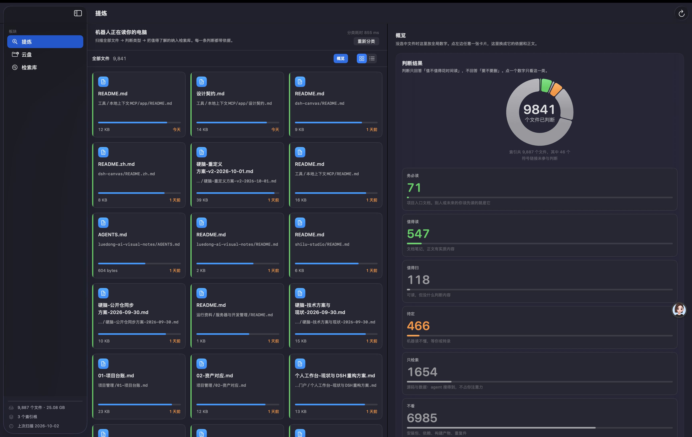

# localvault · 本地上下文

**把你的电脑变成 agent 能读懂的上下文。**

`localvault` 把你指定的本机目录索引成 agent 可以直接检索的上下文，并提供一套**只读**的
文件治理体检。它回答的不是「我的硬盘上有什么」，而是：

- **哪些文件值得花时间读** —— 一条六级的注意力梯子，见下
- **这些文件讲了一件什么事** —— 一次调用把工作区地图书注入 agent 的系统提示词
- **哪里在悄悄浪费空间** —— 重复文件、陈旧文件、断链、该归档没归档



```sh
localvault init          # 探测 ~/Desktop 与 ~/Downloads，写出本机配置
localvault index         # 建索引（首次几秒到几分钟）
localvault setup-dsh     # 生成 MCP 插件配置
```

## 两条不变量

这个软件的一切设计都从这两条推出来。它们不是宣传语，是**代码里守着的**：

**1. 这个软件不会动你的文件。**
它不移动、不改名、不删除你的任何东西。`vault_audit` 和 `propose_organize` 只出报告 ——
`propose_organize` 连"往哪放"都只在你自己配了 `policy.inboxDir` 之后才敢说。

「只读」到底指什么，分三层说 —— **这三层的答案不一样，混起来讲就是骗人**：

| | 读 / 写 | 说明 |
| --- | --- | --- |
| **你的文件** | 只读 | 硬承诺。CLI 和 App 都不写 |
| **它自己的索引库** `~/.localvault/` | CLI **要写** | `index` 本来就是写库。删掉这个目录等于没装过 |
| **App 读索引库** | 只读 | 以 `file:...?mode=ro` 打开，写操作被拒绝 |

那条「写操作被拒绝」的断言在 **App 自检**里（`LocalVault --selftest`），
**不在** `localvault doctor` 里 —— `doctor` 只检查环境和可读性。

**2. 索引不出这台机器。**
零运行时依赖、零网络请求、零遥测。没有云、没有服务器、没有隧道、没有 embedding ——
只用 Node 内置模块 + `node:sqlite`。

「零依赖」和「零网络」都有实测支撑：24 个 `require` 目标里没有一个是第三方模块
（只有 `node:fs/os/path/crypto/child_process/sqlite` ＋ 相对路径）；在索引进程存活期间
用 `lsof -nP -a -p <pid> -i` 轮询，**零网络套接字**；再用猴子补丁拦 `net`/`dns`/`tls`/`http`/`https`/`fetch`
重跑一遍，**零拦截**。

至于**具体路径、目录名、文档名**：`mcp-server/` 侧确实一个都没有（测试里有一条
「隔离性」守卫，专门断言别的主目录上搜不到开发者的词）。这条守得比较严。

> 什么叫「只读」的边界：它**读**你的文件来建索引。索引库在 `~/.localvault/`，
> 删掉它等于没装过。

---

## 哪些文件值得读：六级梯子

这是这个项目最核心的一块，也是被实测推翻重做过的一块。

| 级 | 名 | 证据（实测区分度） | 典型规模 |
| --- | --- | --- | ---: |
| 0 | **务必读** | 项目入口文档（**3.08×**） | 71 |
| 1 | **值得读** | 文档笔记 + 实质正文（**2.30×**） | 547 |
| 2 | **值得扫** | 其余可读文档 | 118 |
| 3 | **待定** | 图片/音视频/设计稿 —— 机器读不懂，**不冒充结论** | 466 |
| 4 | **只检索** | 源码/数据/配置 —— agent 搜得到，不占你注意力 | 1,654 |
| 5 | **不看** | 安装包、依赖、构建产物、重复件 | 6,985 |

**为什么不是「值得了解 / 待定 / 没用」三档？** 因为那是量出来的错。旧的三档里
「值得了解」不是被**选**出来的，是**过网后的默认值** —— 过了硬件滤网的 2,829 个里
2,363 个（83.5%）都落进去。原因是它的四条正面信号里有三条几乎没有区分度：

| 正面信号 | 全库命中率 | 「值得了解」命中率 | 区分度 |
| --- | ---: | ---: | ---: |
| 90 天内改动 | 99.8% | 99.9% | **1.00×** |
| 在项目目录里 | 100.0% | 100.0% | **1.00×** |
| 人类命名 | 94.3% | 93.7% | **0.99×** |
| 有可读正文 | 75.2% | 95.6% | 1.27× |

**一条信号如果在全库和某一档里命中率一样，它就不配当证据。** 按这个标准，
「正文含第一人称『我』」1.23×、「正文含判断/认为/决定」1.26×、「正文长度」1.25×
也都被删掉了 —— 反直觉，但 `.md` 和源码里到处都是「我」和「决定」。
真正的信号是**位置与角色**，不是**内容措辞**。

于是「值得了解」从 2,363 个收到 **736 个**（3.2×），而且每一级都拿得出区分度 > 2× 的证据。
判定顺序本身也是设计：

```
不看 → 待定 → 务必读 → 只检索 → 值得读 / 值得扫
```

「务必读」排在「只检索」**之前** —— 入口文档即使躺在代码目录里也算，判的是它的**角色**，
不是它装的东西。而 `.pdf` 不算入口文档：`Mac操作说明 完全指南.pdf`（别人的教程手册）
曾经因为名字含「说明」混进「务必读」，实测事故。

---

## 为什么是这个形状

它是从一台**重型个人检索系统**反向推出来的假设。那套东西能跑，但它带着
Postgres + pgvector + 向量模型 + SSH 隧道 + Electron 壳：隧道一断，整盘不可用。

那么反过来问一句 —— 如果 96% 的文件是暗的，**「让暗的变亮」这条主线，
能不能先不背这些前提就拿到 80% 的收益？**

| | 重型那套（本项目的出发点） | 本地上下文 |
|---|---|---|
| 依赖 | Python + Postgres + pgvector + 向量模型 + Node/Electron | **无**（Node 内置 + `node:sqlite`） |
| 启动前提 | 一条常驻隧道；**隧道断 = 全盘不可用** | 无前提 |
| 进程数 | 多个后端进程 + Electron 壳 | 0（按需 stdio 子进程） |
| 检索 | trigram + 向量 + 文件名兜底 | LIKE 子串（中文 2 字起） |
| 索引速度 | — | 9,443 文件 / **2.6 秒**，增量 **0.4 秒** |
| 索引体积 | 一个数据库服务 | 93.6 MB SQLite |
| 写操作 | 作业系统能派活 | **不动你的文件**（但它写自己的索引库） |
| 给 agent 的上下文 | 需 agent 主动调工具 | 同时经 MCP `instructions` **自动进系统提示词** |

**它是互补的，不是替代的。** 向量语义检索、OCR、chunk 级质量判定这些东西，
这里一概没有 —— 它们仍然值得存在，只是不必是**第一层**。

---

## 实测（2026-10-01 快照，本机）

> **这一节是一个带日期的快照，不是当前值。** 索引是活的，文件一直在变 ——
> 下面这些数字会漂。要看你自己的，跑 `localvault doctor`。
>
> 已知漂移（2026-10-02 复测）：扫描 **9,887** 文件（不是 9,443）、
> 可搜正文 **7,400 / 74.8%**（不是 7,315 / 77.5%）、`instructions` **8,300** 字节（不是 8,201）、
> vault.db **93.6 MB**（不是 90 MB）。**只有六级梯子的分布没有漂**，因为它是判断逻辑的产物。

```
索引根：工作区 9,333 文件 / 16.7GB    桌面 9 / 1.19GB    下载 101 / 4.49GB
扫描：9,443 文件 / 1,553 目录，跳过 206 个机器生成目录，2.6 秒，0 错误
增量：0.4 秒（9,442 个文件复用，只有 1 个新文件被抽取）
索引正文：84 MB → vault.db 90 MB
instructions：8,201 字节 / 上限 32,768

首次体检结果：
  重复文件   346 组完全重复（可回收 10.45 GB）+ 6 组同名
  陈旧文件   440 个 / 808MB 超过 180 天未动
  命名违规   9 个「最终版/副本」类命名
  待整理     1 个（0 个超期）
  根目录     2 个规则外散文件、23 个分类目录
  断链       12 条 / 检查 1,122 条本地链接
```

> **重复文件那一行修过一次，原来是错的。** 最初报「可回收 143MB」，真值是 **10.45 GB**，
> 差了 72 倍。原因有两层，必须一起改：`maxBytes` 决定谁参与比对（512 MiB 上限把 164 个文件、
> 22.82 GB 挡在门外），而 `budget` 是**累计**哈希预算 —— 最大的一组（3.33 GB）一进门就撑爆预算，
> `break` 掉，一个都没算。两组上限同时放开到 4 GiB / 64 GiB 后才拿到真值（11.1 秒）。
> 报告现在还会显式列出**哪些文件没参与比对**，不再把部分结果说成全部。

> **命名检查做过一次收敛。** 最初用裸子串匹配，命中 130 个——但把内置 Python 运行时里的
> `NEWS2x`、`PatternGrammar3.12.14.final.0.pickle`、`folder.gif`（含 `old`）、
> `new-keystore.sh`（新建 keystore，不是"新版"）全算进来了。
> 改成**词元边界 + 末尾锚定**、并排除 `node_modules`/`site-packages`/`dist`/`.app` 内部后，
> 降到 **9 个**，且全是真命中（`mermaid-diagram (1).png`、`review-final.json` 等）。
> 「文件名过长」也一并排除了内容寻址名（`<sha256>.json`）这类机器生成命名。

### 覆盖度（`disk_coverage`）

```
9,444 个文件里有 7,315 个可搜正文（77.5%）——但按体量只有 0.4%（84.4MB / 22.4GB）

已有正文      7,315  77.5%    84.4MB
超限分块         49   0.5%     702MB
需要格式解析     12   0.1%     165MB   ← pdf/docx/pptx
需要 OCR        822   8.7%     168MB
需要转录         63   0.7%    13.9GB   ← 体量最大的一档
需要解包         43   0.5%    4.42GB
需要查库         29   0.3%     897MB
不必变亮        963  10.2%    2.14GB   ← 动态库/字体/机器包/模型权重
按策略排除      148   1.6%
```

它把暗区**按变亮所需的代价**分层，而不是按文件类型——因为类型驱动不了动作，代价才能。
报告里最该先看的是「**白捡**」（声明是文本却没抽到正文，零成本可修）和
「**不必变亮**」（扣掉它之后的才是真正需要讨论的分母）。


---

## 安装

需要 **Node >= 22.5**（内置 `node:sqlite`）。低于此版本会给出明确提示而不是崩溃。

两个部分，可以只用其中一个：

| | 是什么 | 怎么装 |
| --- | --- | --- |
| **CLI + MCP** | 建索引 + 给 agent 用的 10 个工具 | 从源码装（见下） |
| **Mac App** | 图形界面：提炼 / 云盘 / 检索库 | `.dmg` —— 见 [app/首次运行.md](app/首次运行.md) |

> **这个包还没有发布到 npm。** `registry.npmjs.org/localvault` 目前是 404。
> 所以现在**没有** `npx localvault` 可用 —— 从源码装：

```sh
git clone https://github.com/qiuyiwu1989-star/localvault.git
cd localvault/mcp-server
node cli.js init          # 最稳的一条路：不需要 npm，只要有 node
node cli.js index
```

装成全局命令（有 npm 的机器）：

```sh
npm i -g .                # 之后就有 localvault 命令了
```

> **诚实标注**：`node cli.js` 这条路测过；**`npm i -g .` 没有实测** ——
> 开发这套代码的机器上根本没装 npm（只有 DSH 自带的 node）。所以第一次在别的机器上
> `npm i -g .` 时，如果 `bin` 软链或命令名有问题，请提 issue。
> 不想装全局也可以一直用 `node <repo>/mcp-server/cli.js <命令>`。

> 发布之后会改成 `npm i -g localvault`。这一节以**实测**为准：包一旦上线，这行就换掉。

> **App 必须先有索引才能开。** 它读的是 `~/.localvault/vault.db`，那个库由 CLI 建。
> 所以顺序永远是：先跑 CLI 的 `init` + `index`，再开 App。没有索引时 App 会明确告诉你
> 该跑哪条命令，而不是白屏。

### 0. 认一下这台机器（必做，一次性）

```sh
localvault init
```

零配置时它只探测**系统标准目录**（`~/Desktop`、`~/Downloads`；Linux 上会读
`~/.config/user-dirs.dirs`），因为它们存在才索引，不存在就跳过。**不会**默认索引整个主目录。

要指定自己的目录：

```sh
localvault init ~/Documents/我的项目:工作区 ~/Desktop:桌面
```

已有配置时 `init` **只报告、不覆盖**（要重写加 `--force`），并会提示哪个索引根已经不存在了。

### 1. 建索引

```sh
localvault index           # 首次几秒到几分钟；之后增量
localvault doctor          # 自检
```

### 2. 装 skill

Agent skill 让模型知道**什么时候**该去查本地上下文（而不只是**能**查）。
它只随源码仓库分发：

```sh
git clone https://github.com/qiuyiwu1989-star/localvault.git
sh localvault/scripts/install-skill.sh
```

装到 `~/.agents/skills/local-context-mcp/SKILL.md`，即时生效、无需重启。

> npm 包里**没有** skill，也没有 `install-skill` 命令 —— `npx localvault` 的用户拿不到它。
> 这是当前的已知缺口，不是文档遗漏。

### 3. 装 MCP（在 DSH 界面里）

```sh
localvault setup-dsh                   # 或 --out <目录>
```

这一步生成 `cordis.patch.yml`，**把路径绑定到你本机的安装位置**——所以它是「配置」，
不是「硬编码」。生成后：侧边栏 **Plugins** → **Add plugin** → 填入命令打印的那个目录
→ 安装完成后 **Enable now**。

启用后模型会多出 `mcp__localvault__*` 工具，**系统提示词里自动带上工作区上下文**。
卸载就在同一个页面上删掉这个 bundle。

> bundle 只做一件事：往当前 profile 插入一行 `@deepseek-ai/dsh-mcp-client`
> （`transport: stdio`）。没有 Host/Client 代码，不会劫持 harness 的任何行为。

---

## 工具

| 工具 | 用途 |
| --- | --- |
| `vault_map` | 完整地图：索引范围、目录用途、权威入口、台账概况、类型分布、规则摘要 |
| `disk_coverage` | 覆盖度报告：多少文件真正可搜，暗区**按变亮代价**分层（白捡 / 格式解析 / OCR / 转录 / 不必变亮） |
| `find_files` | 中文子串检索（2 字起），匹配文件名 / 路径 / 标题 / 各级标题 / 正文；可按类型、扩展名、根目录、路径前缀、时间、体积过滤 |
| `find_project` | 用项目名 / 域名 / 仓库名 / P 编号反查台账条目、卡片、资料目录 |
| `read_text` | 读索引内任意文本文件正文（带行号、分段） |
| `list_directory` | 列目录条目 |
| `recent_changes` | 最近改动（默认 7 天），按顶层目录聚合 |
| `vault_audit` | 治理体检：`duplicates` / `stale` / `naming` / `inbox`（未配置则跳过）/ `root_clutter` / `links` |
| `propose_organize` | 出整理方案（**dry-run，不动文件**）；去向按 `policy.inboxDir`，未配置就只列不指路 |
| `refresh_index` | 增量重建（默认后台子进程，不阻塞对话） |

**资源**（供 `read_mcp_resource` 按需读取）：
`vault://map`（别名 `vault://overview`）、`vault://guide`、`vault://projects`、`vault://recent`、
模板 `vault://file/{path}`。

### 上下文注入

MCP `initialize` 返回的 `instructions` 会成为系统提示词的一部分。内容是**从本机文件系统
实时生成**的，不是手写的，也不进代码：

- 索引了哪些根、多少文件、最新改动日期、数据基线
- 权威入口文档（路径 + 标题 + 更新日期）—— 配置指定的优先，其余**自动发现**
- 顶层目录的用途 —— 配置标注优先，否则从该目录内的 README/索引文档标题推断**并注明出处**
- 台账概况（项目数、分组、基线）
- 用户自己规则文档里的规则原文
- 10 个工具的用法与边界

**哪些是推断来的，报告里都标了来源。** 目录用途后面带「（据 `某文件`）」就是推断结果，
引用前应当扫一眼那个文件确认。地图的 `discovery` 字段集中说明推断情况。

---

## 边界

- **只读。** 不移动、不重命名、不删除任何文件。整理方案永远是报告。
- **密钥不读正文。** `.env`、`*.pem`、`*.key`、`*credential*`、`*secret*`、`id_rsa*` 等
  只记录元数据；`read_text` 会明确拒绝并说明原因。
- **不联网。** 全部本机。
- **不跟随符号链接**（避免环与重复计数），只记一条元数据。
- **跳过机器生成目录**：`node_modules`、`.git`、`dist`、`build`、`.venv`、`Pods` 等 50 余个。
- `.app` / `.framework` 这类 bundle 目录**只记一条元数据、不展开**——所以"下载里有个解压出来的
  ClashX.app（461 个文件）"这类问题看得见，但不会被 461 条噪声淹没。

## 数据位置

| 内容 | 路径 |
| --- | --- |
| 索引库 | `~/.localvault/vault.db` |
| 配置 | `~/.localvault/config.json` |
| 后台索引日志 | `~/.localvault/index.log` |

改索引范围：编辑 `~/.localvault/config.json` 的 `roots`，然后重跑 `index`。常用字段：

| 字段 | 说明 |
| --- | --- |
| `roots` | 索引根，`[{path,label,priority}]` |
| `ignoredDirs` / `denyRead` | 跳过与只记元数据的规则 |
| `policy.inboxDir` | 「收集目录」名，默认 `null` = 不做该项检查 |
| `policy.projectCardDir` | 项目卡片目录，默认 `null` = 不做卡片关联 |
| `policy.rootNavPatterns` | 根目录里哪些文件算「导航」不算散落；设 `[]` 则全部列出 |
| `policy.versionNamePatterns` | 版本化命名词表，**默认值不代表规范** |
| `policy.staleDays` 等 | 阈值 |
| `canonicalDocs` / `dirNotes` / `ledgerFile` / `rulesFile` | **可选覆盖**；留空则自动发现 |

> v1 配置里的 `governance` 块会自动并入 `policy`，`versionSuffixPatterns` 会改名成
> `versionNamePatterns` —— 老配置不用手改。

---

## 目录结构

```
本地上下文MCP/
├── README.md              项目门面
├── CHANGELOG.md           更新日志
├── LICENSE                MIT
├── mcp-server/            零依赖的 MCP 服务器（也带 CLI）
│   ├── server.js          stdio 入口
│   ├── cli.js             init / setup-dsh / index / reindex-cache / map / instructions /
│   │                      search / project / audit / organize / coverage / doctor / ledger
│   ├── lib/
│   │   ├── config.js      通用默认值（零个人路径）+ 配置加载与 v1→v2 迁移
│   │   ├── discover.js    从磁盘推断入口文档 / 目录用途 / 台账 / 规则文档
│   │   ├── walk.js        文件系统遍历
│   │   ├── extract.js     文本抽取（标题 / 各级标题 / 正文 / 本地链接）
│   │   ├── store.js       SQLite（node:sqlite）
│   │   ├── indexer.js     增量索引
│   │   ├── search.js      子串检索 + 字段权重评分 + 摘要
│   │   ├── coverage.js    覆盖度分层（暗区按「变亮代价」分档）
│   │   ├── util.js        共用小工具
│   │   ├── vault.js       地图、入口文档、台账、instructions 生成
│   │   ├── governance.js  六项只读体检 + dry-run 整理方案
│   │   └── mcp.js         MCP 协议层（工具 / 资源 / instructions）
│   ├── test/smoke.js            95 项端到端测试（含真实 stdio 握手 + 通用性防回归守卫）
│   └── test/clean-machine.js    31 项「另一台电脑」安装测试（见下）
├── app/                   macOS 图形界面（SwiftUI）
│   ├── Sources/LocalVault/    窗口 / 提炼 / 云盘 / 检索库 / 地图
│   ├── docs/                  界面截图（含开发过程稿，约 16 MB —— 见下）
│   ├── icon/                  图标源文件与候选稿
│   ├── scripts_build_app.sh   构建 .app
│   ├── scripts_make_dmg.sh    打包 .dmg
│   ├── 首次运行.md           别的电脑上怎么装（含 Gatekeeper 说明）
│   └── 设计契约.md           界面层的冻结约定
├── bundle/                DSH bundle（package.json；cordis.patch.yml 是生成物，不在版本库）
├── skill/local-context-mcp/ 给 agent 的 skill（不含任何具体工作区的内容）
└── scripts/               install-skill.sh / install-bundle.sh
```

> **仓库里最重的是截图。** 18.1 MB 的跟踪内容里，`app/docs/` 占 16.1 MB（20 张，含若干
> 「改版前」这类过程稿），`app/icon/` 占 1.1 MB（含 18 个候选/中间产物，
> 其中 `AppIcon.iconset/` 10 张可以由 `.icns` 重新生成）。源码本身只有 0.3 MB。
> 如果你只关心怎么用，这两块都可以不看。

## 测试

```sh
cd mcp-server
node test/smoke.js               # 95 项端到端
node test/clean-machine.js       # 31 项「另一台电脑」
```

> 用 `node` 直接跑，不需要 npm。`package.json` 里也有 `npm test` / `npm run test:clean`，
> 但那是给有 npm 的机器准备的 —— **开发这套代码的机器上没有 npm**，所以
> `npm i -g .` 这条安装路径**没有被实测过**（`node cli.js` 路径测过）。
>
> `smoke.js` 必须在**有 `~/Desktop` 或 `~/Downloads` 的真实 HOME** 下跑：
> 它有一条断言要求默认索引根真实存在。用假 HOME 跑会看到
> `✗ 零配置默认根全部真实存在 —— []`，那是环境问题不是回归。

### smoke.js —— 95 项

在临时目录里造一个迷你工作区，跑真实索引、真实检索、真实体检，并起真实的 stdio 子进程
做 JSON-RPC 握手与工具调用。

其中一组是**通用性防回归守卫**，把「这是通用软件」写成可执行的断言：
源码里不许出现个人标识；`defaultConfig()` 不许含个人台账/规则/收集目录/入口文档；
零配置必须能加载且默认根真实存在；`setup-dsh` 生成的补丁不许把任何工作区写死成索引根。

### clean-machine.js —— 31 项

**「每台电脑装完配一下就能用」这句话是被验证过的，不是被断言的。**

它真的演一遍：按 `package.json` 的 `files` 清单打包 → 解到干净前缀（模拟 `npm i -g`）
→ 造一个**别人的主目录**（英文内容、完全不同的目录结构）→ 只给 `HOME` 环境变量
→ 跑 `init` / `index` / `search` / `coverage` / `audit`。

其中最关键的一组断言是**隔离性**：在别人那台机器上，搜开发者工作区的词条必须**零命中**，
`instructions` 与地图里也不许出现。（那些词写死在 `test/smoke.js` 与 `test/clean-machine.js`
的禁词表里 —— 那是守卫，不是产品内容。）

还故意放了一个和开发者工作区**同名的目录**（`Desktop/项目管理/`）当诱饵，验证它不会因为
名字相同就被套用一套只属于那台机器的约定。

最后一项验证**可配置性**：给这台机器配上它自己的 `policy.inboxDir`，检查立刻生效。

打包规则本身也是被断言的：白名单只有 `README.md` 和 `LICENSE`，`test/` 和其他 `.md`
不许进包 —— 而且有一条断言专门检查**白名单文件真的在包里**，否则规则退化成"什么都不检查"
也会是绿的。这条断言做过变异测试（清空白名单 / 塞 `NOTES.md` / 塞 `test/`），三种都变红。

## 通用性：三层，越往后越少用到

装到别人电脑上要能用，就不能假定你的目录结构。所以配置分三层，**上一层有值就不看下一层**：

| 层 | 内容 | 谁决定 |
| --- | --- | --- |
| 1. 零配置 | 索引根探测系统标准目录；其余全部留空 | 代码（不含任何具体路径） |
| 2. 自动发现 | 入口文档、目录用途、台账、规则文档**从磁盘推断** | 磁盘上的实际内容 |
| 3. 显式配置 | `canonicalDocs` / `dirNotes` / `ledgerFile` / `rulesFile` / `policy.*` | 用户 |

自动发现能推出多少（在一份真实的 9,000 文件工作区上实测）：

```
台账      → 项目管理/项目台账.json（117 个项目）      ← 完全靠文件名与结构推断
规则文档  → 协作资料/文件管理规则.md
入口文档  → 00-从这里开始.md 排第一（名字强度打分 + 层级惩罚）
目录用途  → 逐目录取 README / 00-* / index 的标题，并记录出处
```

**推断的东西一律标注来源。** 目录用途后带「（据 `某文件`）」就是推断的，要引用先确认那个文件。
猜错时必须看得出是怎么猜的 —— 这是这个工具的一条硬规矩。

刻意**没有**做成默认的东西，因为它们都是特定工作流，不是普遍需求：

| 项目 | 默认 | 想用就配 |
| --- | --- | --- |
| 「收集/待整理」目录检查 | 关闭 | `policy.inboxDir` |
| 项目卡片关联 | 关闭 | `policy.projectCardDir` |
| 版本化命名词表 | 中英默认词表 | `policy.versionNamePatterns` |
| 「根目录该放什么」 | **不判定** | `policy.rootNavPatterns` 只定义哪些算导航文件 |

一条设计纪律：**通用软件没有资格定义「整洁」。** 它只报告事实（根目录有几个文件、
有多少个重复、有多少天没动），判定标准由用户在 `policy` 里写。所以报告里写的是
「命中你配置的词表」，不是「命名违规」。

## 已知限制

- **无语义检索。** 搜"我当年怎么开始创业的"这种意图查询，这里只会做子串匹配。
  这是刻意的取舍 —— 向量检索确实有价值，但它的代价是 Postgres + 常驻隧道 + 一个模型，
  而这一层不值得背。
- **不索引非文本。** 图片、音视频、扫描件 PDF 只记元数据，内容不可搜。
  那是「96% 是暗的」里最大的一块，本工具**不假装解决了它**。
- **mtime 会被设备迁移污染**。`stale` 检查基于 mtime，迁移过的盘上会失真。
- **正文上限**：单文件抽取上限 2MB，入库正文上限 400,000 字符，超出会截断并标注。
- **重名文件**：以绝对路径为唯一键，同名不同目录是两条记录（这是有意的，治理体检会另外报同名簇）。
